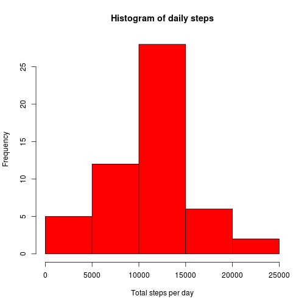
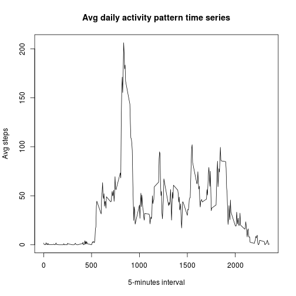
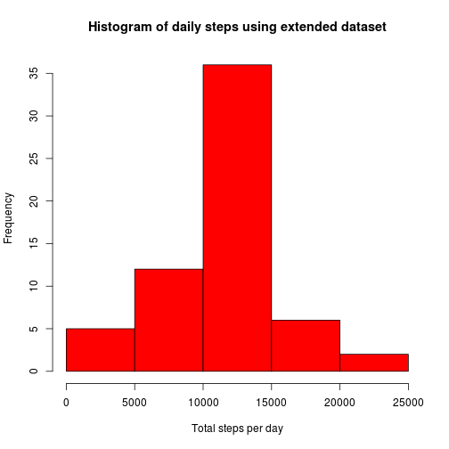
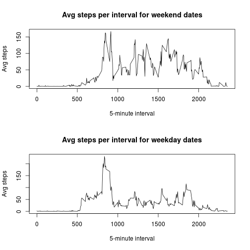

## Loading and preprocessing the data


```r
library(dplyr) # load dplyr to use its goodness.

activity.data <- read.csv("activity.csv")

str(activity.data) # brief overview of the dataset.
```

```
## 'data.frame':	17568 obs. of  3 variables:
##  $ steps   : int  NA NA NA NA NA NA NA NA NA NA ...
##  $ date    : Factor w/ 61 levels "2012-10-01","2012-10-02",..: 1 1 1 1 1 1 1 1 1 1 ...
##  $ interval: int  0 5 10 15 20 25 30 35 40 45 ...
```

## What is mean total number of steps taken per day?


```r
# Section 1:

total.steps.per.day <- activity.data %>%
                       filter(!is.na(steps)) %>% # filter out the NAs in steps column
                       group_by(date) %>%
                       summarise(total.steps = sum(steps))

with(total.steps.per.day,
        hist(total.steps,
             col = "red",
             main = "Histogram of daily steps",
             xlab = "Total steps per day"))
```

 


```r
# Section 2:

# Find median and mean of the total steps per day.
stats.median <- median(total.steps.per.day$total.steps)
stats.mean <- mean(total.steps.per.day$total.steps)
```

The total steps per day mean is **10766** and the median is **10765**.

## What is the average daily activity pattern?


```r
# Section 1:

avg.steps.per.interval <- activity.data %>%
                          filter(!is.na(steps)) %>% # filter out the NAs in steps column
                          group_by(interval) %>%
                          summarise(avg.steps = mean(steps))

# Construct the time series plot.

with(avg.steps.per.interval,
        plot(x=interval, 
             y=avg.steps, 
             type="l", 
             main = "Avg daily activity pattern time series", 
             xlab="5-minutes interval", 
             ylab="Avg steps"))
```

 


```r
# Section 2:

# Find the max value, its index, and the inverval corresponding to the max value.
max.value <- max(avg.steps.per.interval$avg.steps)
max.value.index <- which.max(avg.steps.per.interval$avg.steps)
max.value.interval <- avg.steps.per.interval[max.value.index,][[1]]
```

The maximum average number of step in the time series is **206.1698** for the interval **835**.

## Imputing missing values


```r
# Section 1:

# Compute the number of rows containing NA values.
# Since steps are the measured quantity, that's where the NAs are so we just focus
# on that column.
# We use is.na function to transform the colum into a logical vector and then use
# sum to compute the number we want because sum treats TRUE as 1 and FALSE as 0.
# So all the TRUEs corresponding to NAs get summed up and give us what we want.
count.NA.rows <- sum(is.na(activity.data$steps))
```

The count of rows containing NAs is **2304**.


```r
# Section 2:

# The strategy I chose for imputing missing values is to use the 5-minute interval mean
# across all the days in the dataset. For each row containing steps NA value, I find the
# mean for the corresponding interval and use round function to get the nearest rounded
# integer to the interval mean.

# Construct a function called imputed_value to return an imputed value if steps_arg is NA using
# the stratgey outlined above. The interval corresponding to the steps we are examining is also expected
# to be passed as interval_arg.
# If steps_arg is not a NA then we just return the original argument unchanged.
imputed_value <- function(steps_arg, interval_arg) {
              if (is.na(steps_arg)) {
                 # find the row in avg.steps.per.interval data frame
                 # corresponding to the interval we are seeking.
                 interval_row <- filter(avg.steps.per.interval, interval == interval_arg)
                 # return the rounded integer for the avg.steps
                 return(round(interval_row$avg.steps))
              } 
              else {
                   return(steps_arg) # just pass through the steps_arg if it's not a NA.
              }

}
```

```r
# Section 3:

# Construct a new data frame that extends the activity.data data frame with imputed values for
# missing steps values.
extended.activity.data <- activity.data %>% 
                          # needed so we can apply imputed_value function row-wise
                          rowwise() %>%
                          # use mutate to create a new column containing the imputed values
                          mutate(imputed.steps = as.numeric(imputed_value(steps, interval))) %>% 
                          # select just the new imputed.steps, date, interval columns
                          select(imputed.steps, date, interval) %>%
                          # rename imputed.steps to steps so we have a data frame looking like the old.
                          rename(steps = imputed.steps)
```


```r
# Section 4:

# Using the extended data set, we construct average total steps per interval for all days.
extended.total.steps.per.day <- extended.activity.data %>%
                                group_by(date) %>%
                                summarise(total.steps = sum(steps))

with(extended.total.steps.per.day,
        hist(total.steps,
             col = "red",
             main = "Histogram of daily steps using extended dataset",
             xlab = "Total steps per day"))
```

 

```r
# Find median and mean of the total steps per day using the extended dataaset.
extended.stats.median <- median(extended.total.steps.per.day$total.steps)
extended.stats.mean <- mean(extended.total.steps.per.day$total.steps)
```

The mean of the total steps per day for the extended set is **10765** and the median is **10762**.

Based on the computed values, we conclude that the impact of the imputed values is minimal and does not affect the original histogram and the mean/median values by much.

## Are there differences in activity patterns between weekdays and weekends?


```r
# Section 1:

# load the chron library so can use the is.weekend function which works very well for our purpose.
library(chron)

# add new factor column date.type to denote which date is a weekend or weekday.
extended.activity.data$date.type <- factor(ifelse(is.weekend(extended.activity.data$date), 
                                                  "weekend", 
                                                  "weekday"))
```


```r
# Section 2:

avg.steps.per.interval.weekend <- extended.activity.data %>%
                                  filter(date.type == "weekend") %>%
                                  group_by(interval) %>%
                                  summarise(avg.steps = mean(steps))

avg.steps.per.interval.weekday <- extended.activity.data %>%
                                  filter(date.type == "weekday") %>%
                                  group_by(interval) %>%
                                  summarise(avg.steps = mean(steps))

par(mfrow = c(2,1))
with(avg.steps.per.interval.weekend,
        plot(x=interval,
             y=avg.steps,
             type="l",
             main="Avg steps per interval for weekend dates",
             xlab="5-minute interval",
             ylab="Avg steps"))

with(avg.steps.per.interval.weekday,
        plot(x=interval,
             y=avg.steps,
             type="l",
             main="Avg steps per interval for weekday dates",
             xlab="5-minute interval",
             ylab="Avg steps"))
```

 
